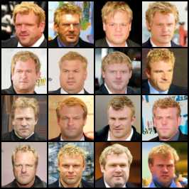
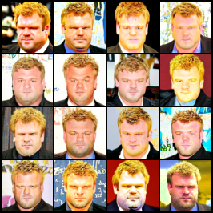
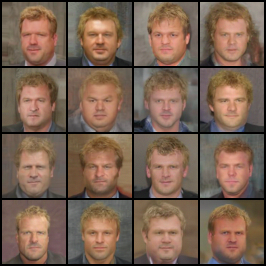

# Gated Manifold-Projected Classifier-Free Guidance for Flow Matching (CFG-MP)

CMU 10-799 course project, in preparation for publication.

Classifier-free guidance (CFG) at high guidance scale improves conditioning strength but pushes the sampling
iterate off the data manifold, degrading fidelity. This repository implements **CFG-MP**: a training-free,
model-agnostic *corrector* that runs after each guided Euler step and slides the iterate back toward a point
where the model's own unconditional velocity field is self-consistent — interpreted as projecting back onto
the model's manifold. Two accelerations make the corrector affordable: **Anderson extrapolation** and
**time gating**, which pays the corrector cost only during the middle of the trajectory.

## Model

- **Backbone**: DiT-B/2 (depth 12, hidden 768, 12 heads, patch 2), `input_size=64`, `in_channels=3`.
- **Objective**: rectified flow / flow matching, trained directly in **64×64 RGB pixel space — no VAE**.
- **Data**: CelebA-64, conditioned on CelebA's **40 binary attributes** via a `MultiLabelEmbedder` MLP with a
  learned `null_token` used for CFG dropout (the unconditional branch is a *trained* null embedding, not `y=0`).
- **Time convention**: `t=0` is noise, `t=1` is data; `x_t = (1-t)·x_0 + t·x_1`, target velocity `v = x_1 - x_0`.
  This is **inverted relative to standard DDPM notation** — "Early" gating means near-noise, "Late" near-image.
- **Sampling**: forward-Euler ODE integration, `N=50` uniform steps by default.

## Method

After the CFG predictor step `x⁰ = z_t + v_cfg·dt`, the corrector performs extra **unconditional-only** model
evaluations at the post-step point `t' = t + dt` and fixed-point iterates

```
G(x) = x + ( v_θ(x, t', ∅) − v̄_∅ ) · dt · s
```

where `v̄_∅` is the unconditional velocity already computed during the CFG pass (reused, not recomputed) and
`s = --proj-step-scale` (default `0.5`). The fixed point satisfies `v_θ(x*, t', ∅) = v̄_∅`.

| Method | Corrector |
|---|---|
| `uncond` | none (unconditional baseline) |
| `cfg` | none (vanilla CFG baseline) |
| `cfg_interval` | none — competitor baseline: guidance applied only for `t ∈ [--w-tmin, --w-tmax]` (default `[0.3, 0.7]`), pure **conditional** velocity outside, so the uncond forward is skipped there (Kynkäänniemi et al., [arXiv:2404.07724](https://arxiv.org/abs/2404.07724)) |
| `cfg_pp` | none — competitor baseline: our flow-matching analogue of CFG++ ([arXiv:2406.08070](https://arxiv.org/abs/2406.08070)); denoise to `x̂₁` with the guided velocity, renoise `x̂₀` with the **unconditional** one. `--cfg-scale` is λ ∈ (0,1] here (typical 0.2–0.8), **not** a large `w` |
| `cfg_mp_std` | plain Picard fixed-point iteration, `K−1` iterations (`--proj-K`, default 3) |
| `cfg_mp_anderson` | Anderson-accelerated (type-II, memory depth 1), mixing coefficient computed **per sample** |
| `cfg_mp_anderson_gated` | Anderson, applied only for `t ∈ [tmin, tmax]` (default `[0.3, 0.7]`) |
| `cfg_mp_icml` | direct competitor's operator ([arXiv:2601.21892](https://arxiv.org/abs/2601.21892)) `G(x) = x − ½Δt·v(t′,x,∅) + ½Δt·v(t′, x − ½Δt·v(t′,x,∅), y)` at the post-step time `t′`, iterated `K−1` times (default 2 = the paper's recommended FPI); **2 NFE per iteration** (the two forwards are sequential, not batchable) |
| `cfg_mp_icml_anderson` | the same competitor `G` wrapped in the identical type-II Anderson (m=1, β=1) extrapolation; fixed 2 applications of `G` |
| `cfg_mp_icml_anderson_gated` | `cfg_mp_icml_anderson` fired only for `t ∈ [tmin, tmax]` — **our time gate applied to the competitor's corrector**, showing the gating contribution transfers to CFG-MP+ |

Two orthogonal flags:

- `--w-schedule {constant,linear}` (default `constant`) — applies to `cfg` and every `cfg_mp_*` variant.
  `linear` is the mean-preserving increasing ramp `w(t) = 1 + (w−1)·2t` (Wang et al.,
  [arXiv:2404.13040](https://arxiv.org/abs/2404.13040)): starts at 1, ends at `2w−1`, averages `w` over `t ∈ [0,1]`.
- `--fresh-anchor` — applies to `cfg_mp_std` / `cfg_mp_anderson` / `cfg_mp_anderson_gated`. Replaces the stale
  anchor `v̄_∅ = v_θ(z_t, t, ∅)` with `v̄_∅ = v_θ(z_t + v_∅·dt, t′, ∅)`, the unconditional field re-evaluated at
  `t′` at the **unconditional Euler continuation**. Both sides of the fixed-point condition then live at `t′`.
  Costs **+1 NFE per corrected step**. (The anchor deliberately is *not* the guided post-predictor point `x⁰` —
  that point is a fixed point of its own corrector, which would make the corrector a no-op.)

### NFE at `--num-steps 50`

| Method | NFE / step | NFE / sample |
|---|---|---|
| `uncond` | 1 | 50 |
| `cfg` (vanilla) | 2 | 100 |
| `cfg_interval` `[0.3, 0.7]` | 2 in / 1 out | **71** |
| `cfg_pp` | 2 | 100 |
| `cfg_mp_std` (K=3) | 4 | 200 |
| `cfg_mp_anderson` | 4 | 200 |
| `cfg_mp_anderson_gated`, Middle `[0.3, 0.7]` | 4 in / 2 out | **142** (29% cheaper than full Anderson) |
| `cfg_mp_icml` (K=3 → 2 iters) | 6 | 300 |
| `cfg_mp_icml_anderson` | 6 | 300 |
| `cfg_mp_icml_anderson_gated`, Middle `[0.3, 0.7]` | 6 in / 2 out | **184** (39% cheaper than ungated CFG-MP+) |

Add `+1` NFE per corrected step for `--fresh-anchor` (e.g. `cfg_mp_anderson` → 250, gated-Middle → 163).

At default settings `cfg_mp_std` and `cfg_mp_anderson` are NFE-matched, so that comparison is
quality-at-matched-compute, not a speedup. NFE is logged per run to `generation_stats.json`.

## Qualitative comparison

Fixed attributes `Male ∧ Chubby ∧ Blond_Hair`, seed 50, 4×4 grids. Vanilla CFG at low vs high scale, and the
Anderson-corrected sampler at the same seed:

| vanilla CFG (low scale) | vanilla CFG (high scale) | CFG + Anderson corrector |
|---|---|---|
|  |  |  |

The high-scale vanilla grid shows the textbook off-manifold signature — pushed saturation, hardened edges,
backgrounds collapsing to flat colour. The corrected grid sits closer to the low-scale grid in colour and
background naturalism while keeping the conditioned attributes legible. This is a visual impression, not a
measurement.

## Repository layout

Live code is at the repository root:

| File | Purpose |
|---|---|
| `models.py` | DiT backbone, `MultiLabelEmbedder`, `DiT_models` registry |
| `train.py` | Flow-matching training loop (`accelerate`, bf16) |
| `dataset.py` | CelebA-64 loading/preprocessing, `create_dataloader` |
| `download_dataset.py` | Builds `./data/local_celeba` (`real_images/` + `attributes.pt`) |
| `sample_generator.py` | **Canonical sampler** — all 10 methods, NFE accounting |
| `sample-cfg-mp.py`, `sample-vanilla-cfg.py` | Qualitative grid generation |
| `evaluate_metrics.py` | FID + attribute accuracy |
| `evaluation.sh` | 5-method comparison sweep |
| `ablations.py` | CFG-scale sweep (vanilla baseline + gated corrector) and gate sweep |
| `time_ablation.sh` | Time-gating sweep (Early / Middle / Late / Full) |
| `hf_push.py` | Uploads a checkpoint to the Hub |

- `legacy/` — inert code inherited from the upstream forks. Not imported, not executed. See `legacy/README.md`.
- `fast-DiT.wiki/` — **full project documentation**: method derivation, architecture notes, complete runbook,
  evaluation protocol, and a list of known issues. Start at `fast-DiT.wiki/Home.md`.

## Quickstart

Dependencies: `torch`, `torchvision`, `timm`, `accelerate`, `diffusers`, `datasets`, `huggingface_hub`,
`pytorch_fid`, `scikit-learn`, `pandas`, `tqdm`, `pillow`, `numpy`. (`environment.yml` is upstream's and incomplete.)

**1. Data** — writes `./data/local_celeba/real_images/*.png` (FID reference) and `attributes.pt`
(the index-aligned conditioning pool). Takes no arguments; run once.

```bash
python download_dataset.py
```

**2. Train** — note `--feature-path` is the HF cache root, not a feature directory (the flag name is an
upstream leftover); the dataset is streamed from the Hub.

```bash
accelerate launch train.py \
  --model DiT-B/2 --image-size 64 --num-classes 40 \
  --feature-path ./data/hf_cache \
  --global-batch-size 256 --epochs 3000 --ckpt-every 6000 \
  --results-dir results
```

Checkpoints land in `results/000-DiT-B-2/checkpoints/{step:07d}.pt`; resume with `--resume-from <ckpt>`.

**3. Sample** — writes `<out-dir>/fake/*.png`, `conditions.pt`, and `generation_stats.json`.

```bash
python sample_generator.py --method cfg_mp_anderson_gated \
  --ckpt results/000-DiT-B-2/checkpoints/0072000.pt \
  --cfg-scale 4.0 --tmin 0.3 --tmax 0.7
```

Other flags: `--num-samples` (1000), `--batch-size` (100), `--num-steps` (50), `--proj-K` (3),
`--proj-step-scale` (0.5), `--alpha-clamp`, `--seed` (50), `--out-dir`.

**4. Evaluate**

```bash
python evaluate_metrics.py \
  --fake-dir <out-dir>/fake \
  --real-dir ./data/local_celeba/real_images \
  --classifier FarStryke21/celeba-resnet18-classifier
```

**5. Sweeps** — `ablations.py` sweeps `w ∈ {2,4,6,8}` for both vanilla CFG and the gated corrector, then the
gating windows, and writes `ablation_summary_{timestamp}.csv`. `time_ablation.sh` runs the gate sweep alone
(configuration is edited at the top of the script).

```bash
python ablations.py --ckpt results/000-DiT-B-2/checkpoints/0072000.pt
./time_ablation.sh
```

## Evaluation protocol

- **FID** via `pytorch-fid` against 1000 real CelebA-64 images. At `N=1000` FID is biased; **only the relative
  ordering across methods is meaningful.**
- **Attribute accuracy** from the Hub classifier `FarStryke21/celeba-resnet18-classifier`, reported as
  exact-match (all 40 correct) and element-wise over the 40 attributes.
- **NFE** logged to `generation_stats.json` per run, so quality is always read against compute.
- All methods share seed 50 and the same `torch.randperm` conditioning selection, so every method sees
  identical noise and identical attribute vectors — the comparison is **paired**.

## Assets

| | |
|---|---|
| Dataset | [`electronickale/cmu-10799-celeba64-subset`](https://huggingface.co/datasets/electronickale/cmu-10799-celeba64-subset) |
| Model | [`FarStryke21/cmu-10799-dit-b2`](https://huggingface.co/FarStryke21/cmu-10799-dit-b2) |
| Classifier | [`FarStryke21/celeba-resnet18-classifier`](https://huggingface.co/FarStryke21/celeba-resnet18-classifier) |

## License

CC-BY-NC 4.0, inherited from Meta's DiT. See `LICENSE.txt`.
